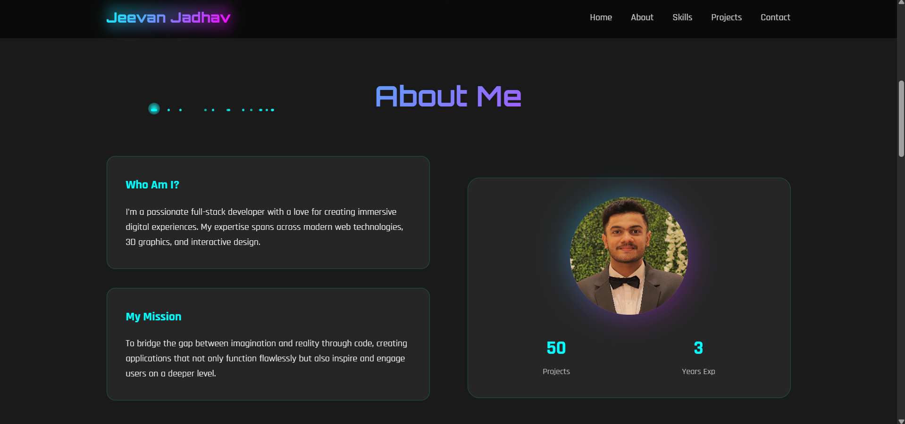

# Portfolio Template 6

A sleek, responsive portfolio website template built using HTML, CSS, and JavaScript. Perfect for creative professionals looking to showcase their work online.

---

## Preview





## Features

* **Responsive Design** – Optimized for desktop, tablet, and mobile.
* **Clean Layout** – Visually appealing structure for portfolio presentation.
* **Interactive Elements** – Includes dynamic effects powered by JavaScript.
* **Easy to Customize** – Modify content, styles, and behavior via simple file edits.

## Installation

1. Clone the repository:

   ```bash
   git clone https://github.com/NOVA0206/Portfolio-Template-6.git
   cd Portfolio-Template-6
   ```
2. Open `Portfolio6.html` in your preferred browser to view the template.

## Customization

* Replace image files (`Jeevan.jpg`, `Zhongli.jpg`, `bg.jpg`) with your own visuals.
* Add or restructure sections in HTML to match your needs.
* Update CSS variables or selectors for branding changes.
* Enhance interactivity by modifying or adding to the existing JavaScript.

## License

Licensed under the MIT License. See [LICENSE](LICENSE) for full terms.

## Contributing

Contributions are welcome! To contribute:

1. Fork the repo.
2. Create your feature branch:

   ```bash
   git checkout -b feature/YourFeature
   ```
3. Commit your changes:

   ```bash
   git commit -m "Add YourFeature"
   ```
4. Push to the branch:

   ```bash
   git push origin feature/YourFeature
   ```
5. Submit a pull request describing your changes.

## Contact

Repo Owner: **NOVA0206**

Gmail: **jeevanj020604@gmail.com**

Name: **Jeevan Jadhav**

---
